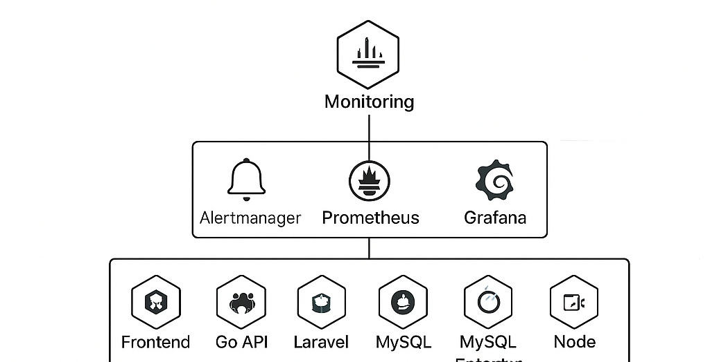
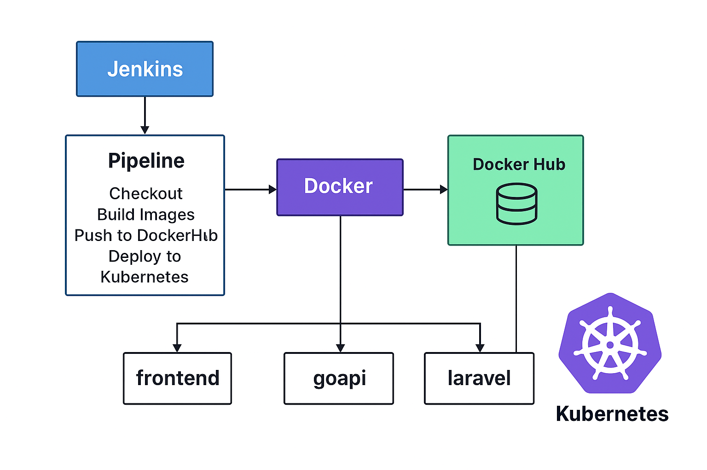

# 🚀 Deployment Guide — (Laravel + Go + Frontend + MySQL)



Jenkins berperan sebagai alat otomatisasi (CI/CD) yang menjalankan proses build → push → deploy secara otomatis setiap kali ada perubahan kode.
Panduan ini menjelaskan langkah-langkah lengkap untuk:
1. Build Docker image untuk setiap komponen aplikasi.
2. Push image ke registry (contoh: Docker Hub).
3. Deploy semua komponen ke Kubernetes.

---

## 📂 Struktur Project
```bash
rootProject/
├── laravel/
│ ├── Dockerfile
│ └── (source code Laravel)
├── go/
│ ├── Dockerfile
│ └── (source code Go API)
├── frontend/
│ ├── Dockerfile
│ └── (source code Frontend)
├── k8s/
```

> 📁 Folder `k8s/` berisi semua file manifest Kubernetes.

---

## ⚙️ Prasyarat

Pastikan hal-hal berikut sudah siap:

- Akun **Docker Hub** (atau registry lain seperti GitLab, ECR, GCR)
- Tools:
  - `docker`
  - `kubectl`
  - `helm` (opsional)
- Kubernetes cluster aktif (misal: Minikube, EKS, GKE, k3s)
- Login ke Docker Hub:
  ```bash
  docker login

## 🏗️ Tahapan Build & Push Image

Ubah DOCKER_USERNAME di bawah sesuai username Docker kamu.

```bash
export DOCKER_USERNAME=sotar
export PROJECT_NAME=iconplusTest
```

## 1️⃣ Build dan Push Laravel Image
```bash
cd laravel
docker build -t $DOCKER_USERNAME/$PROJECT_NAME-laravel:latest .
docker push $DOCKER_USERNAME/$PROJECT_NAME-laravel:latest
```
## 2️⃣ Build dan Push Go API Image
```bash
cd ../go
docker build -t $DOCKER_USERNAME/$PROJECT_NAME-goapi:latest .
docker push $DOCKER_USERNAME/$PROJECT_NAME-goapi:latest
```
## 3️⃣ Build dan Push Frontend Image
```bash
cd ../frontend
docker build -t $DOCKER_USERNAME/$PROJECT_NAME-frontend:latest .
docker push $DOCKER_USERNAME/$PROJECT_NAME-frontend:latest
```

## 🧩 Update Deployment YAML
Pastikan file deployment di folder k8s/ sudah memakai image yang kamu push.


---

## ⚙️ Prasyarat

Sebelum memulai deployment, pastikan:

1. Kubernetes cluster sudah **running** (misalnya di Minikube, k3s, EKS, GKE, atau AKS).
2. Sudah terinstall tools berikut:
   - `kubectl`
   - `helm` (opsional untuk monitoring)
   - `docker` (untuk build image)
3. Image Docker untuk semua service sudah **tersedia di registry** (misal Docker Hub atau private registry).
4. Pastikan akses internet ke registry tidak diblokir dari cluster.

---

## 🏗️ Tahapan Deployment

### 1️⃣ Buat Namespace

Namespace digunakan agar resource terisolasi dalam cluster.

```bash
kubectl apply -f namespace.yaml
kubectl apply -f docker-reg-secret.yaml
kubectl apply -f mysql-secret.yaml
kubectl apply -f configmapLaravel.yaml
kubectl apply -f mysql-deployment.yaml
kubectl apply -f laravel-deployment.yaml
kubectl apply -f laravel-init-job.yaml
kubectl apply -f go-deployment.yaml
kubectl apply -f frontend-deployment.yaml
kubectl apply -f ingress.yaml
```
Pastikan Ingress Controller (misalnya NGINX Ingress) sudah aktif di cluster.
Untuk Minikube:

```bash
minikube addons enable ingress
```

## ✅ Verifikasi Deployment

Cek semua pod:
```bash
kubectl get pods -n devops
```

# Monitoring Kubernetes menggunakan Prometheus & Grafana

Dokumentasi ini menjelaskan cara melakukan instalasi **Prometheus** dan **Grafana** pada cluster Kubernetes menggunakan Helm Chart **kube-prometheus-stack**.
Sistem monitoring ini dibangun menggunakan template monitoring siap pakai (Prometheus, Grafana, Node Exporter, dan Kube-State-Metrics) untuk mempercepat proses implementasi dan memastikan konfigurasi sesuai standar industri.
Pendekatan ini dipilih karena menyediakan integrasi otomatis antar-komponen Kubernetes, mengurangi potensi kesalahan konfigurasi manual, serta memudahkan pemeliharaan dan skalabilitas sistem monitoring di lingkungan cluster.

## Prasyarat
Pastikan sudah terinstall:
- Kubernetes Cluster (Minikube / K3s / Kind / EKS / GKE / AKS / dll)
- `kubectl`
- `helm`

## 1 Buat Namespace Monitoring
```bash
kubectl create namespace monitoring
```
## 2. Tambahkan Helm Repository Prometheus dan Grafana
```bash
helm repo add prometheus-community https://prometheus-community.github.io/helm-charts
helm repo add grafana https://grafana.github.io/helm-charts
helm repo update
```
## 3. Install Prometheus + Grafana (kube-prometheus-stack)
```bash
helm install prometheus prometheus-community/kube-prometheus-stack -n monitoring
```
### 4. Akses Grafana
Cek password default Grafana:
```bash
kubectl get secret prometheus-grafana -n monitoring -o jsonpath="{.data.admin-password}" | base64 --decode ; echo
```
## 5. Port Forward untuk Akses dari Local:
```bash
kubectl port-forward svc/prometheus-grafana 3000:80 -n monitoring
```

## forward semua port service nya untuk diakses dilokal
## ➡️  Forwarding Laravel (8001)
```bash
kubectl port-forward -n devops svc/laravel-service 8001:8001
```
## ➡️  Forwarding Frontend (3000)
```bash
kubectl port-forward -n devops svc/frontend-service 3000:3000
```
## ➡️  Forwarding Go API (8080)
```bash
kubectl port-forward -n devops svc/goapi-service 8080:8080
```
## Namespace monitoring
## ➡️  Forwarding Grafana (3001)
```bash
kubectl port-forward -n monitoring svc/prometheus-grafana 3001:80
```
## ➡️  Forwarding Prometheus (9090)
```bash
kubectl port-forward -n monitoring svc/prometheus-kube-prometheus-prometheus 9090:9090
```


saya buat diluar installer kube-prometheus-stack.tgz agar bisa diinstall secara offline


# CI/CD Pipeline dengan Jenkins, Docker, dan Kubernetes

Pipeline ini digunakan untuk melakukan otomatisasi proses **build**, **push**, dan **deploy** pada aplikasi yang terdiri dari 3 service:
- Frontend
- Go API
- Laravel

Pipeline berjalan menggunakan **Jenkins**, membangun image menggunakan **Docker**, menyimpan image di **Docker Hub**, dan melakukan deployment ke **Kubernetes** cluster.

---

## 🏗 Struktur Project
```bash
rootProject
├── frontend/ # Source code frontend
├── go/ # Source code Golang API
└── laravel/ # Source code Laravel API
```


---

## 🔧 Tools yang Digunakan
| Tools | Fungsi |
|------|--------|
| Jenkins | CI/CD pipeline automation |
| Docker | Build dan packaging aplikasi menjadi container image |
| Docker Hub | Registry penyimpanan image |
| Kubernetes | Menjalankan aplikasi dalam bentuk container di cluster |

---

## ⚙️ Environment Variables
| Variable | Keterangan |
|---------|------------|
| `DOCKER_HUB_USER` | Username Docker Hub untuk push image |
| `NAMESPACE` | Namespace Kubernetes tempat deployment berjalan |

---

## 🔐 Credential yang Diperlukan
| Credential ID | Tipe | Digunakan Untuk |
|---------------|------|----------------|
| `dockerhub-creds` | Username + Password Docker Hub | Login saat push image |

Pastikan credential ini sudah dibuat di **Jenkins → Manage Credentials**.

---

## 🚀 Alur CI/CD Pipeline

| Stage | Fungsi |
|------|--------|
| **Checkout** | Mengambil source code dari GitHub |
| **Build Images** | Build image Docker untuk masing-masing service |
| **Push to Docker Hub** | Push image yang sudah di-build ke Docker Hub |
| **Deploy to Kubernetes** | Update image deployment & restart rollout di cluster |

---

## 🧱 Jenkinsfile
```groovy
pipeline {
    agent any

    environment {
        DOCKER_HUB_USER = 'sotar12'
        NAMESPACE = 'devops'
    }

    stages {
        stage('Checkout') {
            steps {
                git branch: 'main', url: 'https://github.com/sotardodo/iconplus.git'
            }
        }

        stage('Build Images') {
            steps {
                sh '''
                docker build -t $DOCKER_HUB_USER/frontend:latest ./frontend
                docker build -t $DOCKER_HUB_USER/goapi:latest ./go
                docker build -t $DOCKER_HUB_USER/laravel:latest ./laravel
                '''
            }
        }

        stage('Push to Docker Hub') {
            steps {
                withCredentials([usernamePassword(credentialsId: 'dockerhub-creds', usernameVariable: 'USER', passwordVariable: 'PASS')]) {
                    sh '''
                    echo "$PASS" | docker login -u "$USER" --password-stdin
                    docker push $DOCKER_HUB_USER/frontend:latest
                    docker push $DOCKER_HUB_USER/goapi:latest
                    docker push $DOCKER_HUB_USER/laravel:latest
                    '''
                }
            }
        }

        stage('Deploy to Kubernetes') {
            steps {
                sh '''
                kubectl set image deployment/frontend -n $NAMESPACE frontend=$DOCKER_HUB_USER/frontend:latest
                kubectl set image deployment/goapi -n $NAMESPACE goapi=$DOCKER_HUB_USER/goapi:latest
                kubectl set image deployment/laravel -n $NAMESPACE laravel=$DOCKER_HUB_USER/laravel:latest
                kubectl rollout restart deployment frontend -n $NAMESPACE
                kubectl rollout restart deployment goapi -n $NAMESPACE
                kubectl rollout restart deployment laravel -n $NAMESPACE
                '''
            }
        }
    }
}

```
## ✅ Hasil Akhir

`Setiap kali ada perubahan code yang dipush ke GitHub:
- Jenkins akan otomatis build image terbaru
- Image akan dipush ke Docker Hub
- Kubernetes akan menggunakan image terbaru dan deployment di-rollout ulang
- Pipeline otomatis berjalan end-to-end.